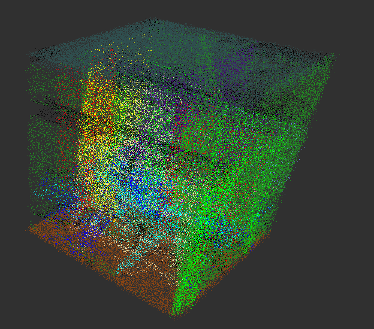
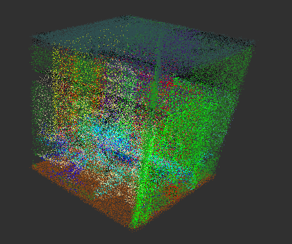
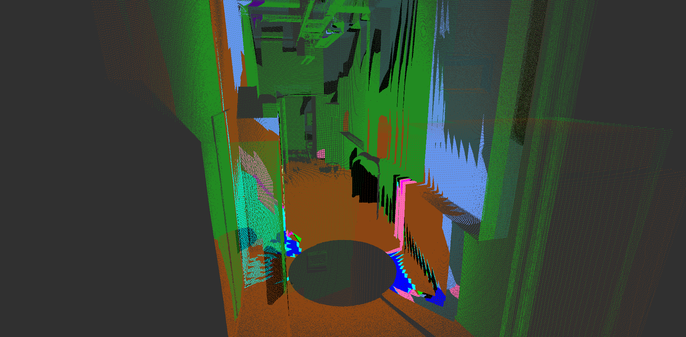

# PointNet Segmentation on S3DIS Dataset

## Requirements
* Pytorch with your favourite cuda
* Open3D


## Instructions

### Dataset

[Dataset](http://buildingparser.stanford.edu/dataset.html)
Download the dataset 'Stanford3dDataset_v1.2_Aligned_Version' in 'point_net' folder.
Also for testing on new scan (much different than dataset), I suggest to download scans from [here](https://www.ifi.uzh.ch/en/vmml/research/datasets.html), particularly scans in [here](https://files.ifi.uzh.ch/vmml/RoomsReconstructionDatasets/office1.zip), and place them in 'point_net' folder


### Main Training
```bash
# convert the S3DIS dataset into hd5 format
python s3dis_reducer.py
cd point_net
# train the pointnet on training and validation data of S3DIS
python main_train.py
# test pointnet on testing data of S3DIS
python main_test.py
cd ..
```


### Plotting
```bash
cd point_net

# plot train and validation metrics and save them as png
python plot_train_val_metrics.py

# plot predictions and ground truth pointclouds of testing S3DIS dataset and save them as png
python pointclouds_2_png.py

# compare the ground truth and predictions of testing S3DIS dataset over epochs, in single png
python compare_png.py
```


### Testing on Unseen Data
```bash
python test_new.py --path <path to .ptx file>
```


## Ground Truth vs Predicted Point Cloud

<div style="display: flex; justify-content: space-around; align-items: center;">
    <figure>
        
        <figcaption>Ground Truth</figcaption>
    </figure>
    <br>
    <br>
    <br>
    <figure>
        
        <figcaption>Predicted</figcaption>
    </figure>
</div>

## Segmentation Performance Over Epochs


## Testing on Unseen Point Cloud
<figure>
    
    <!-- <figcaption>Segmentation of OOD Point Cloud</figcaption> -->
</figure>


